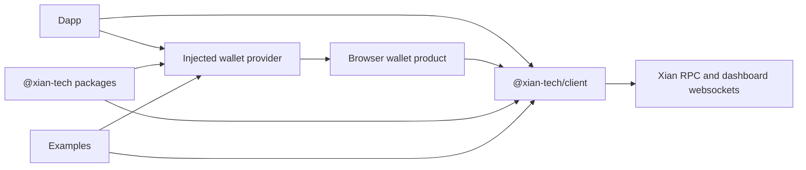

# xian-js

`xian-js` is the JavaScript / TypeScript SDK workspace for integrating Xian
from browsers, wallets, dapps, and Node.js applications. It owns the typed
RPC client, the browser wallet provider contract, the injected-wallet
discovery layer, and runnable integration examples.

The repo is a TypeScript monorepo. Packages publish independently under the
`@xian-tech/*` scope. Browser wallet *product* code lives in the sibling
[`xian-wallet-browser`](../xian-wallet-browser) repo; this repo provides the
SDK and provider primitives that wallet implementations depend on.

## Workspace Shape



## Quick Start

```bash
npm install
npm run validate
```

Build a transaction, sign it, and broadcast it:

```ts
import { Ed25519Signer, XianClient } from "@xian-tech/client";

const signer = new Ed25519Signer();
const client = new XianClient({
  rpcUrl: "http://127.0.0.1:26657",
  dashboardUrl: "http://127.0.0.1:8080",
});

const tx = await client.buildTx({
  sender: signer.address,
  contract: "currency",
  function: "transfer",
  kwargs: { to: "bob", amount: 5 },
  chi: 50_000,
});

const signedTx = await client.signTx(tx, signer);
const submission = await client.broadcastTx(signedTx, { mode: "checktx" });
console.log(submission.txHash);
```

### Wallet-Side Registration

Register a wallet provider so dapps can discover it:

```ts
import { registerInjectedXianProvider } from "@xian-tech/provider";

registerInjectedXianProvider({
  provider,
  metadata: {
    id: "xian-wallet",
    name: "Xian Wallet",
    rdns: "org.xian.wallet",
  },
  setAsDefault: true,
});
```

### Dapp-Side Discovery

```ts
import { InjectedXianWallet } from "@xian-tech/provider";

const wallet = await InjectedXianWallet.waitForInjected({ timeoutMs: 1_000 });
const accounts = wallet ? await wallet.connect() : [];
const [account] = accounts;
const info = await wallet?.getWalletInfo();
await wallet?.watchAsset({
  type: "token",
  options: { contract: "currency", symbol: "XIAN", name: "Xian" },
});
```

The provider package uses `window.xian` for the default provider namespace,
`window.xianProviders` for multi-wallet discovery, and dispatches the
`xian#initialized` event when a wallet registers itself.

For transaction flows, injected wallets can:

- sign or send a fully prepared unsigned tx
- prepare the tx inside the wallet with `prepareTransaction(...)`
- send an intent directly with `sendCall(...)`

## Integration Cookbook

Use the client directly when your code owns the signer, such as local
automation, tests, or server-side tooling:

```ts
import { Ed25519Signer, XianClient } from "@xian-tech/client";

const signer = new Ed25519Signer(process.env.XIAN_PRIVATE_KEY);
const client = new XianClient({
  rpcUrl: "http://127.0.0.1:26657",
  dashboardUrl: "http://127.0.0.1:8080",
});

const [chainId, status, balance] = await Promise.all([
  client.getChainId(),
  client.getStatus(),
  client.token().balanceOf(signer.address),
]);

console.log(chainId, status.result, balance);
```

Read contract state, metadata, and simulation results:

```ts
const reserve = await client.getState("con_pairs", "reserves", ["1"]);
const metadata = await client.token("currency").metadata();
const quote = await client.call({
  sender: signer.address,
  contract: "con_dex",
  function: "getAmountsOut",
  kwargs: { amountIn: 10, src: "currency", path: [1] },
});

console.log(reserve, metadata.symbol, quote);
```

Submit a direct transaction with automatic chi estimation:

```ts
const submission = await client.token("currency").transfer({
  signer,
  to: "bob",
  amount: 5,
  mode: "checktx",
  waitForTx: true,
});

console.log(submission.txHash, submission.accepted, submission.finalized);
```

Submit prebuilt contract deployment artifacts:

```ts
const submission = await client.submitContract({
  name: "con_counter",
  deploymentArtifacts,
  signer,
  mode: "checktx",
  waitForTx: true,
});
```

Compile and deploy contract source when `@xian-tech/compiler` is installed:

```ts
const submission = await client.deployContract({
  name: "con_counter",
  source,
  signer,
  mode: "checktx",
  waitForTx: true,
});
```

Use `submitContract` when you already have deployment artifacts, or inject a
compiler into `deployContract` in environments that manage the compiler module
themselves.

Use an injected wallet when a dapp must not see private keys:

```ts
import { InjectedXianWallet } from "@xian-tech/provider";

const wallet = await InjectedXianWallet.waitForInjected({ timeoutMs: 1_000 });
if (!wallet) {
  throw new Error("No Xian wallet detected");
}

const [account] = await wallet.connect();
const chainId = await wallet.getChainId();
const info = await wallet.getWalletInfo();

const prepared = await wallet.prepareTransaction({
  chainId,
  contract: "currency",
  function: "transfer",
  kwargs: { to: "bob", amount: 5 },
});
const signed = await wallet.signTransaction(prepared);
const sent = await wallet.sendTransaction(prepared, {
  mode: "checktx",
  waitForTx: true,
});

console.log(account, info.capabilities, signed, sent.txHash);
```

For the common dapp path, let the wallet prepare, sign, and broadcast from an
intent:

```ts
const submission = await wallet.sendCall(
  {
    chainId,
    contract: "currency",
    function: "transfer",
    kwargs: { to: "bob", amount: 5 },
  },
  { mode: "checktx", waitForTx: true },
);
```

Subscribe to dashboard websocket streams:

```ts
const blockSub = client.watch.blocks((message) => {
  console.log("block", message.height, message.hash);
});

const balanceSub = client.watch.state(
  `currency.balances:${signer.address}`,
  (message) => {
    console.log("balance changed", message.value);
  },
  { onError: console.error },
);

// Later, for cleanup:
await blockSub.unsubscribe();
await balanceSub.unsubscribe();
```

Talk to a shielded relayer:

```ts
import { XianShieldedRelayerClient } from "@xian-tech/client";

const relayer = new XianShieldedRelayerClient({
  relayerUrl: "http://127.0.0.1:38480",
});
const info = await relayer.getInfo();
const quote = await relayer.getQuote({
  kind: "shielded_command",
  contract: "shielded_note_token",
  targetContract: "currency",
});

console.log(info.available, quote.relayerFee, quote.expiresAt);
```

The browser dapp under
[`examples/browser-dapp`](examples/browser-dapp/README.md) exercises these
same flows interactively.

## Principles

- **Browser and wallet integration first.** The package surface is shaped
  for dapps, browser wallets, and TS-first Node.js code.
- **Official JS/TS surface for Xian.** This repo is the canonical home for
  the JS client, the wallet provider contract, and the injected-wallet
  discovery shape.
- **Aligned with `xian-py`.** Transaction signing behavior, broadcast modes,
  and wire formats stay aligned with the Python SDK so the same chain
  semantics apply on both sides.
- **No backend convenience here.** Backend- and operator-oriented patterns
  (SQLite projections, daemon helpers) belong in `xian-py`, not in the
  browser-focused core packages.
- **Wallet product is separate.** The browser wallet product lives in
  `xian-wallet-browser`; this repo only provides the SDK and provider
  primitives.

## Key Directories

- `packages/client/` — `@xian-tech/client`: typed RPC client, transaction
  builder, Ed25519 signer, websocket subscriptions.
- `packages/provider/` — `@xian-tech/provider`: browser wallet provider
  contract, an in-memory reference implementation, and the injected-wallet
  discovery helpers.
- `packages/types/` — shared TypeScript types used across packages.
- `packages/web-kit/` — `@xian-tech/web-kit`: shared browser-app helpers for
  wallet connection, RPC client persistence, formatting, toasts, and React
  integration.
- `examples/` — runnable integration examples that exercise the public
  packages.
  - `browser-dapp/` — dapp-side playground for reads, provider calls,
    websocket subscriptions, and intent-based transaction flows.
- `apps/` — internal apps used during development.
- `docs/` — repo-local architecture, backlog, and release notes.

## Validation

```bash
npm install
npm run typecheck
npm run build
npm run test
```

`npm run validate` runs the same gates that CI uses.

## Related Docs

- [AGENTS.md](AGENTS.md) — repo-specific guidance for AI agents and contributors
- [docs/README.md](docs/README.md) — index of internal docs
- [docs/ARCHITECTURE.md](docs/ARCHITECTURE.md) — major components and dependency direction
- [docs/BACKLOG.md](docs/BACKLOG.md) — open work and follow-ups
- [docs/RELEASING.md](docs/RELEASING.md) — package release process
- [../xian-wallet-browser/README.md](../xian-wallet-browser/README.md) — the browser wallet product that consumes these packages
