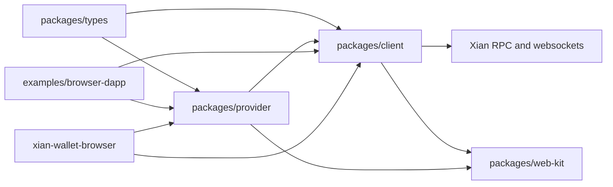

# Packages

This folder contains the publishable `xian-js` workspace packages.

Current packages:

- `client/`: typed RPC client, tx helpers, Ed25519 signer, and websocket
  subscriptions (`@xian-tech/client`)
- `provider/`: browser provider contract, injected-wallet discovery, and a
  simple in-memory provider (`@xian-tech/provider`)
- `types/`: shared transaction, signer, number, and broadcast-mode types
  (`@xian-tech/types`)
- `web-kit/`: shared browser-app helpers for wallet connection, RPC client
  persistence, formatting, toasts, and React integration
  (`@xian-tech/web-kit`)

Dependency direction:

- `types/` has no workspace dependencies
- `client/` and `provider/` build on `types/`
- `provider/` may depend on the client contract; `client/` must remain
  provider-agnostic
- `web-kit/` builds on `client/` and `provider/`

