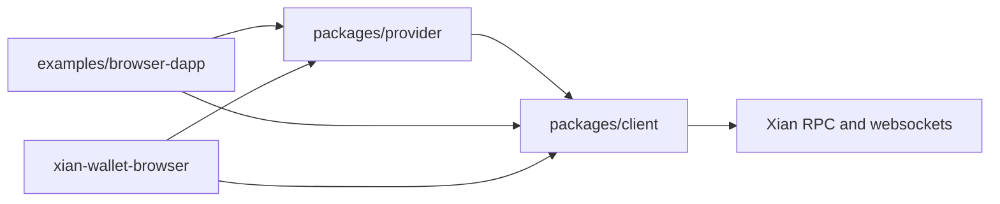

# Packages

This folder contains the publishable `xian-js` workspace packages.

Current packages:

- `client/`: typed RPC client, tx helpers, Ed25519 signer, and websocket
  subscriptions
- `provider/`: browser provider contract and a simple in-memory provider
- `../examples/browser-dapp/`: runnable browser example built against the
  public package exports

Dependency direction:

- `provider/` may depend on the client contract
- `client/` must remain provider-agnostic

