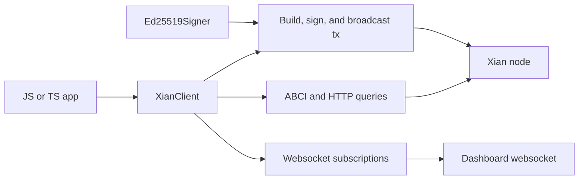

# @xian-tech/client

This package owns the typed Xian client surface for JS / TS consumers.

It includes:

- HTTP and ABCI query helpers
- transaction payload building, signing, and broadcast helpers
- versioned, chain/account-bound external message signing helpers
- raw Ed25519 primitives for transaction internals and explicit low-level use
- websocket subscriptions for dashboard state and event streams

It does not own:

- browser wallet discovery
- wallet-provider event contracts
- framework-specific bindings

`XianClient.sendTx(...)` reserves automatic nonces per client instance, chain,
and sender, including across concurrent calls. It serializes each same-scope
build/sign/broadcast lifecycle so sequential nonces reach CheckTx in order;
different senders and chains remain concurrent. Explicit nonces bypass the
manager. Structured rejection makes the next send refresh the network nonce;
an ambiguous transport or wait timeout blocks further automatic sends until
the network nonce advances or the caller deliberately invokes
`resetNonceReservation(...)` after independent reconciliation.

Use `signXianMessage(...)` and `verifyXianMessage(...)` for external messages.
Their version-1 payload is length-prefixed and binds the signature to a Xian
chain ID and account. `signMessage(...)` and `verifyMessage(...)` operate on raw
UTF-8 bytes and must not be used to implement a wallet's `xian_signMessage`
request.
