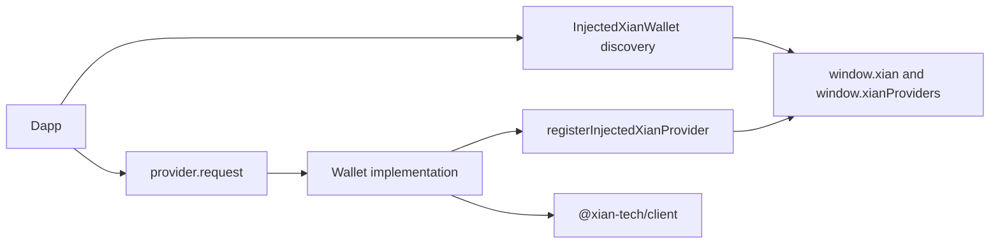

# @xian-tech/provider

This package defines the browser wallet provider surface for Xian and ships a
simple in-memory provider plus injected-wallet discovery helpers.

It includes:

- `request(...)`-based provider interface
- account and chain event handling
- a reference provider that delegates signing and submission to `@xian-tech/client`
- browser injection and discovery helpers for `window.xian` and
  `window.xianProviders`
- a dapp-facing wrapper around an injected provider

Core helpers:

- `registerInjectedXianProvider(...)`: wallet-side registration into the global
  browser namespace
- `listInjectedXianProviders(...)`: enumerate known injected wallets
- `getInjectedXianProvider(...)`: resolve the default or matching injected
  wallet
- `waitForInjectedXianProvider(...)`: await late wallet injection via the
  `xian#initialized` event
- `InjectedXianWallet`: dapp-facing convenience wrapper for connect, chain,
  wallet info, asset watching, transaction preparation, sign, and send flows
- `ProviderBackedXianSigner`: adapter that lets provider-backed wallets fit
  signer-based APIs that only need `getAddress()` and `signMessage()`

Current provider request methods include:

- `xian_getWalletInfo`
- `xian_requestAccounts`
- `xian_accounts`
- `xian_chainId`
- `xian_switchChain`
- `xian_watchAsset`
- `xian_prepareTransaction`
- `xian_signMessage`
- `xian_signTransaction`
- `xian_sendTransaction`
- `xian_sendCall`

It does not own:

- framework bindings
- production wallet custody flows

